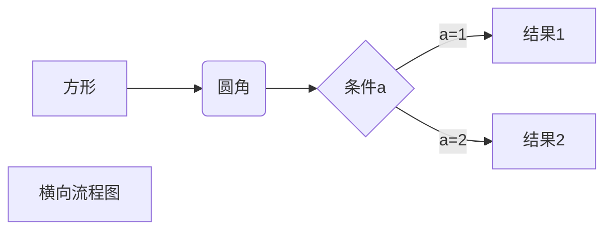

# Hello

标题

- 各级标题可以在前面添加数个#实现

- # 一级

- ## 二级

- ### 三级

- #### 四级

- ##### 五级

- ###### 六级

- 最多六级（几级标题就添加几个#）  

---


段落格式

- 段落末尾加上两个空格再回车可以完成换行
- 或是使用一个空行来换行


***

有以下三种字体

- 斜体* （在文字两端添加\*文字\* )
- **粗体** （在文字两端添加\*\*文字\*\*）
- ***粗斜体***（在文字两端添加\*\*\*文字\*\*\*）

***

- 分割线：在一行中加入三个以上 * 或是 - 。但是行内不允许有其他字符（除了空格）
- ~~删除线~~ ：在文字两端添加\~\~文字\~\~实现
- <u>下划线</u>:通过加入\<u\>文字\</u\> 实现
- 脚注：输入\[^文字]添加脚注[^脚注 ]

---

列表

 	1. 有序列表
	
	* 输入数字+ . 生成有序列表
 	2. 无序列表
	- 使用单个字符（*）（-）（+）作为列表标记
	3. 列表可以嵌套

***

区块

 1. 在段落开头使用(>+空格)建立区块

	> 区块示例

	2. 区块可以嵌套

	>第一层
	>
	>> 第二层
	>>
	>> > 第三层

	3. 区块可以使用列表

	> 1. 第一
	> 2. 第二
	>
	> - 无序列表

	4. 列表中使用区块需要四个空格的缩进

	- 第一

		> 列表嵌套区块

---

代码

1. 单个代码或片段用（`)实现

	- `print()` 函数

2. 代码区块用(```)包裹一段代码，可以指定一种语言

	```python
	import math
	int x
	x = math.sqrt(9)
	print("x=",x)
	```

---

链接

1. \[链接名称](链接地址)
	- 这是个链接[Tower](http://tower.im)
	- 或者直接使用链接地址\<链接地址\> <http://tower.im>
2. 可以用变量代替链接地址，在文末带变量地址
	- 这个链接用tower作为变量[Tower][tower]

---

图片

- 图片语法格式
	- \!\[alt 属性文本\](图片地址 "可选标题")
	- \标签可以指定长宽 

---

表格

- 使用（ | )分割单元格，使用（-）分割表头
- 右对齐（-:）左对齐（:-）居中对齐（:-:）

| 第一列 | 第二列 |
| ------ | ------ |
|        |        |

---

特殊操作

1. 支持使用HTML元素
	- \<kbd>\<b>\<i>\<em>\<sup>\<sub>\<br>等
2. 特殊字符需要用转义字符（\）
3. 公式可以使用（$$)包裹TeX或LaTeX格式的数学公式来实现
4. 流程图
	- 使用(\```mermaid```)实现
	- 横向流程图（LR）竖向流程图（TD）



---


[^脚注 ]: 脚注示例

[tower]:http://tower.im